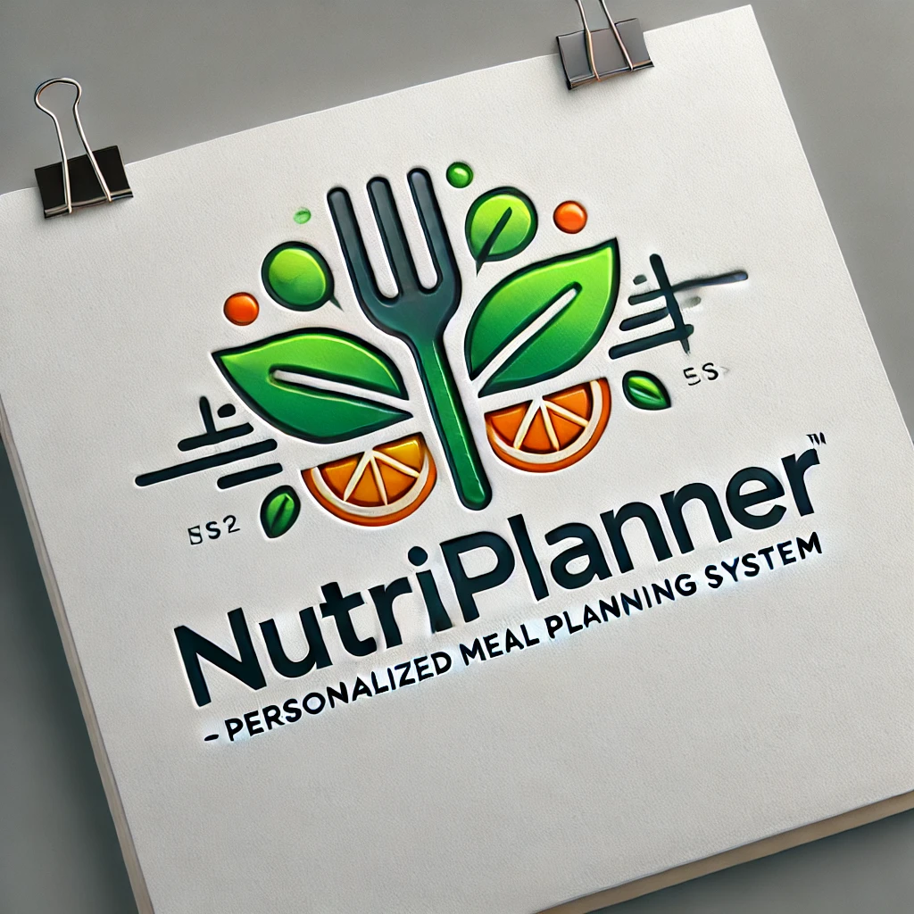

# NutriPlanner-Personalized-Meal-Planning-System

  

<h1 align="center">NutriPlanner-Personalized-Meal-Planning-System</h1>

    <em><code> 🥗 healthier eating habits by providing users with a tailored approach to meal planning based on their individual needs, preferences, and goals.🥗 </code></em>

    <a href="https://github.com/ChixMagnet08">Louis Andre G. Lopez</a> 
    IT-2106

---

  
<strong>Table of Contents<strong>

  
  - [Project Overview](#project-overview)
  - [Problem Statement: Chosen SDG](#problem-statement-chosen-sdg)
  - [OOP Principles](#oop-principles)
  - [Features](#features)

---

##  Project Overview

Many individuals struggle with maintaining a balanced diet tailored to their health goals. Proper meal planning can improve overall well-being but often requires nutrition knowledge and consistent tracking. NutriPlanner is a Java console application designed to help users create personalized meal plans based on their health goals and dietary preferences, promoting healthier habits. NutriPlanner aligns with SDG Good Health and Well-being, encouraging users to make informed nutritional choices and supporting better health outcomes.

---

## Problem Statement: Chosen SDG

Good Health and Well-Being
Contribution: Supports better health outcomes by ensuring adherence to medication schedules.

    
   
  <em>SDG 3: Supporting the health and well-being of Human.</em>

---

## OOP Principles
The project incorporates Object-Oriented Programming (OOP) principles to ensure modularity, reusability, and clear structure.

1. **Encapsulation**  
   - Hides internal data and provides controlled access through getters and setters (e.g., `User` class and `UserValidator` methods).  

2. **Inheritance**  
   - Promotes code reuse; `Donor` inherits from `User` to access its properties and methods.  

3. **Polymorphism**  
   - Allows different classes to define unique implementations of a method (e.g., `DonationType` with abstract `confirmAndProcessDonation` method).  

4. **Abstraction**  
   - Hides unnecessary details; `User` class provides abstracted methods like `getName()` and `verifyPin()` for interacting with user data.  

---

## Features
Meal Planning:
o   "The application generates a daily meal plan, including breakfast, lunch, dinner, and snacks, tailored to the user’s health goals and dietary preferences."
Nutritional Tracking:
o   "Users can view a summary of their total daily calorie intake and macronutrient distribution, helping them stay on track."
Personalization:
o   "Users input their age, weight, height, health goal (e.g., weight loss, muscle gain), and dietary preferences to receive customized meal suggestions."

---
